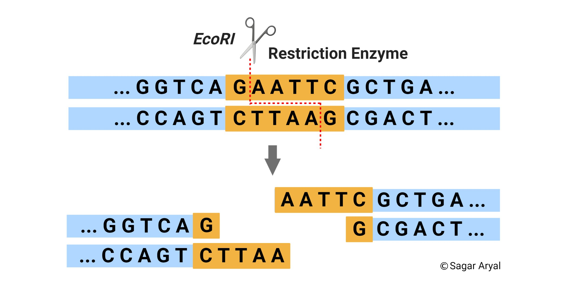

# DNA Sequence Analysis & Removal of Restriction Sites

This is a solution of team NULL 404 (Arman Bolatov, Daniil Filimonov, Polina Rakhalskaya, Darina Mukhamejanova) for [BioHackathon 2021](http://code-on.info/) organized by IGEM.

## Table of contents

  * [Problem statement](#problem-statement)
  * [Technologies](#technologies)
  * [Key features](#key-features)
  * [Project structure](#project-structure)
  * [How to use](#how-to-use)
  * [Naming conventions](#naming-conventions)

## Problem statement

The DNA contains specific base order which can correspond to restriction sites. A restriction site is a sequence of approximately 6–8 base pairs of DNA that binds to a given restriction enzyme. For example EcoRI restriction site:



These sites allow restriction enzymes to cut DNA strands into two pieces. In synthetic biology, this cut allows the insertion of a specific gene. However, some restriction sites in DNA can be redundant when it is used in a laboratory.

The IGEM competition has a specific DNA design submission standard where some restriction sites are unacceptable. According to IGEM, this is done to allow future users of submitted DNA to use them without facing problems from those restriction sites. There are two standards: RFC-10 and Type IIS RFC-1000. Hence the illegal restriction sites are:

<table>
  <tr>
    <th>Base sequence (5' → 3')</th>
    <td>GAATTC</td>
    <td>TCTAGA</td>
    <td>ACTAGT</td>
    <td>CTGCAG</td>
    <td>GCGGCCGC</td>
    <td>GCTCTTC</td>
    <td>GGTCTC</td>
  </tr>
  <tr>
    <th>Base name</th>
    <td>EcoRI</td>
    <td>XbaI</td>
    <td>SpeI</td>
    <td>PstI</td>
    <td>NotI</td>
    <td>SapI</td>
    <td>BsaI</td>
  </tr>
</table>

Apart from these standards, other standards can be followed but are not mandated by IGEM.

Therefore, one base change should “hide” the restriction site. If these restriction sites are in the coding region, the restriction sites should be removed without changing the amino acid sequence. This process should be similar to silent mutation.

The task is:

- To create a program that can detect and alter restriction sites of user's choosing.
- The program should not alter the amino acid sequence in the coding region.
- Indicated are only few examples of restriction enzymes, try to make your algorithm useful for any researcher if they wish to "hide" their restriction enzymes.
- Think about other ways you can make your project of use for researchers.

## Technologies

Project is created with:
* Python version: 3.7
* [PySimpleGUI](https://pypi.org/project/PySimpleGUI/) version: 4.51.6
* Pandas version: 1.3.4

## Key features

1. The main feature of this program is that it not only determines the precise location of prohibited restriction sites according to IGEM standards, but also allows the user to hide these sites by altering the **minimum number** of nucleotides.

2. The algorithms are versatile and adaptable, so the researcher may **add new restriction sites** into the database and/or **delete previous ones**, so we are not limited with those provided by default.

3. An intuitive interface visually shows the restriction sites within the DNA sequence and annotates the precise **name and position** of the restriction site.

4. While the user enters DNA sequence for 5’-3’ direction, they receive the similar data output for the **second strand** with reversed direction.

5. The program makes sure that DNA alteration is similar to **silent mutation** and amino acids sequence encoded in coding frame remains the same.

6. Works perfectly for all **bacterial genomes**.

## Project structure

    .
    ├── dictionaries.py              # Dictionaries for converting amino-acids to codons and vice-versa
    ├── main.py                      # The main window with input fields
    ├── messages.py                  # Texts of error messages
    ├── restrictions.py              # The dictionary which maps restrictions base sequences to their names
    ├── result.py                    # The result window with the program output
    ├── sequence_algorithms.py       # Algorithms to analyze DNA strands and hide restriction sites
    ├── presentation.pdf             # PDF document with instructions
    ├── __pycache__                  # Folder containing cached files
    └── README.md

## How to use

To clone and run this program, you'll need [Git](https://git-scm.com) and [Python](https://www.python.org/) installed on your computer. From your command line:

```bash
# Install PySimpleGUI (you should have pip)
$ pip install PySimpleGUI
# Clone this repository
$ git clone https://github.com/armanbolatov/DNA-Sequence-Analysis
# Go into the repository
$ cd DNA-Sequence-Analysis
# Run the program
$ python main.py
```

In this [presentation](presentation.pdf) you can find further details on how to use the program properly.

## Naming conventions

Here naming conventions should be described:

1. Amino Acids. Source: [www.hgmd.cf.ac.uk](http://www.hgmd.cf.ac.uk/docs/cd_amino.html)
2. Restriction Sites (from 5' to 3'). Source: [www.sciencedirect.com](https://www.sciencedirect.com/topics/immunology-and-microbiology/restriction-site#:~:text=A%20restriction%20site%20is%20a,by%20cleaving%20the%20viral%20DNA.)
